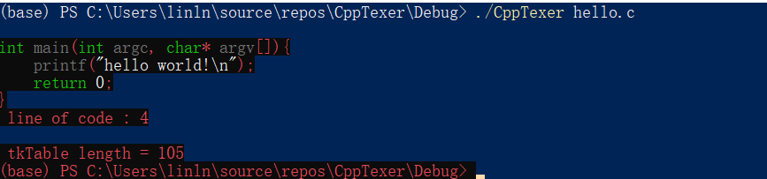
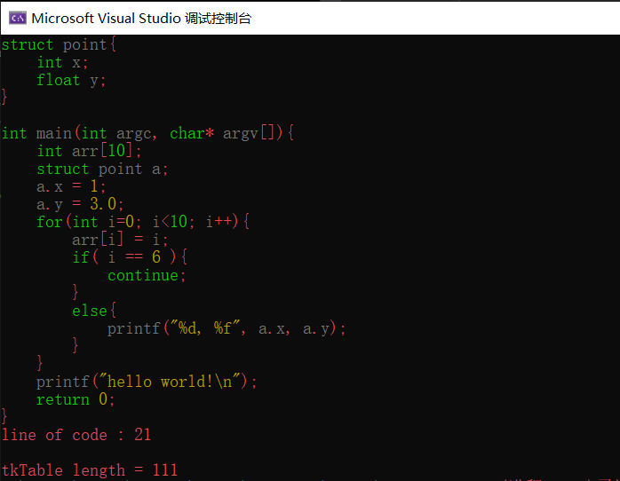
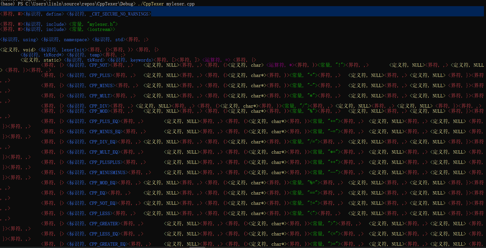

# 

# Now I successfully lexer the hello.c and realized a colorization to visualize it

# 

# **Todo List**
- [x]   Simple lexer
- [x]   Simple Shader
- [ ]   Error Correction

# **Usage** :o:
>Input: any C/Cpp/h source file

>Output: token streams organized in the same form as the source file 


# ***Five BIG*** *types of tokens in total, each of them is printed in different color*
> &nbsp; < *identifier* > 
> 
> &nbsp; < *definator* >
> 
> &nbsp; < *constant* >
> 
> &nbsp; < *boundary* >
> 
> &nbsp; < *operator* >

# ***100 small*** *types of tokens in details*
 *which include commen Keywords in C, all the notations ~!@#$%^&*()_+{}:"<>?[]\;',./ , different kinds of numbers such as float, double or expon numbers, constant string and so on...*

# ***Some*** *kinds of method to detect the lexical error in the src file 
 *Now it can recognize the identifier defination error and error formart of numbers, wrong header reference and so on*

## *The first test example's result use Mylexer v1.0 is as follows:*
## 

## *The second test example's result use Mylexer v1.0 is as follows:*
## 

## *The third test example's result use Mylexer v1.1 is as follows:*
## 

## I lexical analysized the source code of my lexer using my lexer


## Then a complicated full of mistakes example test7.c was used. But now I got a few problems. To be Continue;


## *Implementation Details::*

### Global variable
```
    + int wordCount = 0; // 源代码单词数
    + int charCount = 0; // 源代码字符数
    + int lineCount = 0; // 源代码行数
    + int curLineSize = 0; //当前行字符个数
    + int identifierCount = 0; //源代码标识符个数
    + int definatioinCount = 0; //源代码定义符个数
    + int boundaryCount = 0; //源代码界符个数
    + int constCount = 0; //源代码常数个数
    + int operatorCount = 0; //源代码运算符个数
    + int tokenCount = 0;
    + int token;
    + bool over = false; //标志文件是否读完了
    + char* filename;
    + char* temp = (char *)malloc(sizeof(char) * 256);
    + char ch;

    + BUFFER* buffer = (BUFFER*)malloc(sizeof(BUFFER));

    + FILE* fin;
    + std::map<int, std::pair<char*, char*>> tokenStream;

    + tkWord* tkHashTable[MAXKEY];		//HashTable 
    + dynString tkstr;
    + dynString sourcestr;
  
```

### Use Structure are as follows:
- TkWord
```
    struct TkWord {
        int code;
        struct TkWord* next;
        char* str;
        struct Symbol* symStruct;
        struct Symbol* symIdentifier;
    }tkWord; 
```

- DynString 
```
    typedef struct DynString {
        int len;		//length of the string
        int capacity;	//buffer length
        char* data;		//the pointer to this string
    }dynString;
```

- DynArray
```
    typedef struct DynArray {
        int len;	//len of array;
        int capacity;	//capacity of the buffer
        void** data;	//pointer to array
    }dynArray;
```

- BUFFER
```
    typedef struct BUFFER{
        char data[BUFFER_MAX];
        int len;
        char* startPtr = (char *)malloc(sizeof(char));
        char* cur = (char *)malloc(sizeof(char));//forwardPtr;
    }BUFFER;
```

- Error Handle 
```
    // some error handler structure
    enum errorLevel {
        CPP_WARNING,
        CPP_ERROR
    };

    enum workStage {
        COMPLIE,
        LINK,
    };

    enum LEX_STATE {
        LEX_NORMAL,
        LEX_SEP,
    };
```
